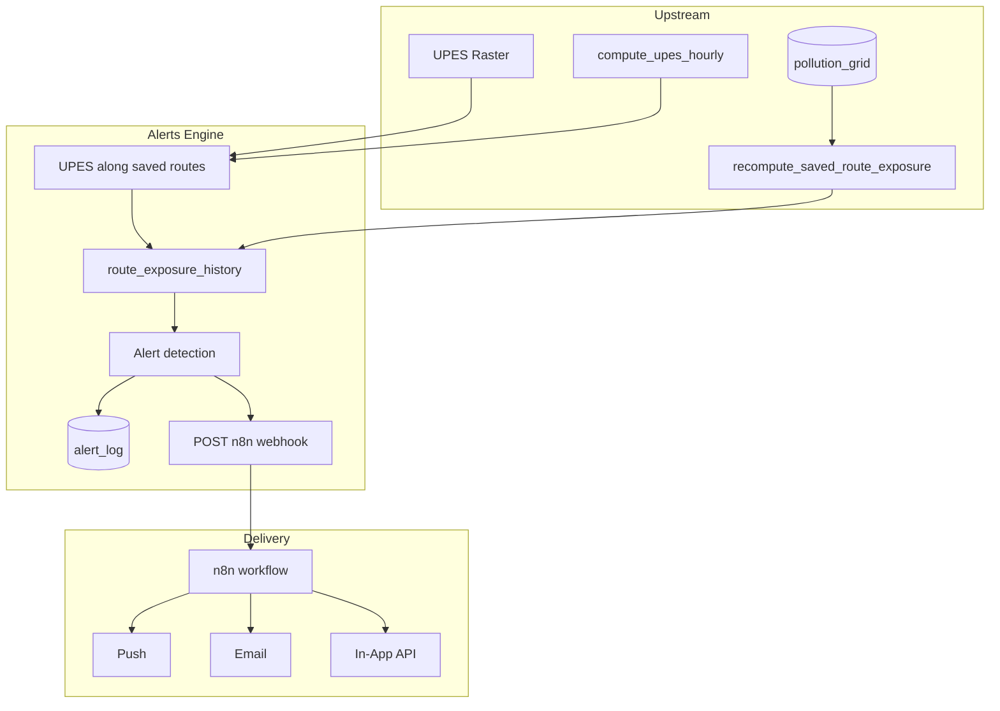

# Alerts & Personalization Engine

This document describes the **Alerts & Personalization Engine**: inputs from UPES and saved-route exposure, sensitivity-scaled alert logic, persistence, and n8n webhook dispatch for multi-channel notifications.

**Implementation verification and n8n workflow setup:** [ALERTS_AND_PERSONALIZATION_VERIFICATION.md](ALERTS_AND_PERSONALIZATION_VERIFICATION.md).

---

## 1. Overview

### Architecture



- **Inputs:** UPES raster (hourly), saved routes with UPES-based scores and history, user sensitivity level (1–5), weather (wind) at route midpoint.
- **Alert types:** Route deterioration, hazard (high UPES along route), wind shift (pollution moving toward route), time-based (current worse than recent best).
- **Outputs:** Rows in `alert_log`; optional POST to n8n webhook for Push / Email / In-App delivery.
- **Schedule:** Celery tasks `compute_saved_route_upes_scores` (at :20) and `run_alert_pipeline` (at :25) after UPES hourly run.

---

## 2. Inputs

| Source | Description |
|--------|-------------|
| **Route exposure (UPES)** | `saved_routes.last_upes_score`, `route_exposure_history` (mean and max UPES along origin→dest line). |
| **User sensitivity** | `users.exposure_sensitivity_level` (1–5) mapped to Normal / Sensitive / Asthmatic; scales deterioration threshold. |
| **User preferences** | `users.notification_preferences` (e.g. `{"email": true, "push": false, "in_app": true}`) for channel selection. |
| **Weather / wind** | WeatherAPI.com at route midpoint: `wind_kph`, `wind_degree` for wind-shift check. |
| **Scheduler** | Celery Beat: UPES route scoring at :20, alert pipeline at :25. |

---

## 3. Alert Types and Trigger Logic

### 3.1 Route deterioration

- **Trigger:** `(current_upes - previous_upes) / previous_upes >= effective_threshold_pct`.
- **Effective threshold:** `base_pct * get_sensitivity_scale(level)` (config: `alerts_deterioration_base_pct` default 0.15).
- **Sensitivity scaling:** Normal (1,2) → 1.0 → 15%; Sensitive (3,4) → 0.7 → 10.5%; Asthmatic (5) → 0.5 → 7.5%.

### 3.2 Hazard

- **Trigger:** `max_upes_along_route >= critical_threshold` (config: `alerts_hazard_threshold` default 0.85).
- Uses `max_upes_along_route` from the same UPES sampling run stored in `route_exposure_history`.

### 3.3 Wind shift

- **Trigger:** Wind direction (where wind is going) aligns with vector from source point to route midpoint within `alerts_wind_angle_deg` (default 45°), and wind speed ≥ `alerts_wind_speed_min_kph` (default 5).
- **Source point:** Optional; when not provided (e.g. no hotspot), wind-shift check is skipped. Can be extended to use high-UPES cell centroid in route bbox.

### 3.4 Time-based

- **Trigger:** Current UPES score ≥ recent minimum (last 24h) + margin (default 0.15). Suggests traveling at a different time.

---

## 4. Sensitivity Mapping

Implemented in `services/alerts/constants.py`:

| exposure_sensitivity_level | Label | Scale |
|----------------------------|--------|-------|
| 1, 2 | Normal | 1.0 |
| 3, 4 | Sensitive | 0.7 |
| 5 | Asthmatic | 0.5 |

`get_sensitivity_scale(level)` and `get_sensitivity_label(level)`.

---

## 5. Configuration

In `config.py` (and `.env`):

| Setting | Default | Description |
|---------|---------|-------------|
| `alerts_enabled` | True | Master switch for alert pipeline. |
| `alerts_deterioration_base_pct` | 0.15 | Base deterioration % (scaled by sensitivity). |
| `alerts_hazard_threshold` | 0.85 | UPES ≥ this along route = hazard. |
| `alerts_wind_speed_min_kph` | 5.0 | Minimum wind speed for wind-shift check. |
| `alerts_wind_angle_deg` | 45.0 | Max angle (deg) for wind toward route. |
| `alerts_n8n_webhook_url` | None | If set, pipeline POSTs alert payload to this URL. |

---

## 6. n8n Webhook Contract

- **Method:** POST.
- **Content-Type:** application/json.
- **Body:**

```json
{
  "alerts": [
    {
      "alert_id": 123,
      "user_id": 1,
      "route_id": 2,
      "alert_type": "route_deterioration",
      "message": "Route exposure increased from 0.30 to 0.42.",
      "score_before": 0.3,
      "score_after": 0.42,
      "channels": ["email", "in_app"]
    }
  ],
  "timestamp": "2025-02-14T12:25:00.000000+00:00"
}
```

- **n8n workflow:** Use a Webhook trigger; branch by `alert_type`; use `channels` to route to Push (FCM/OneSignal), Email (SMTP/SendGrid), and/or In-App (e.g. write to API or let front-end poll `GET /api/alerts`).

---

## 7. API

| Endpoint | Method | Description |
|----------|--------|-------------|
| `GET /api/alerts` | GET | **Protected.** Returns current user's alerts from `alert_log` (last 7 days by default). Query: `route_id`, `alert_type`, `days` (1–90). |
| `PATCH /auth/me` | PATCH | **Protected.** Body: `notification_preferences` (dict), `exposure_sensitivity_level` (1–5). Updates current user. |

---

## 8. Storage

- **route_exposure_history:** `route_id`, `timestamp`, `upes_score`, `max_upes_along_route`, `score_source`. One row per route per UPES scoring run.
- **alert_log:** `user_id`, `route_id`, `alert_type`, `score_before`, `score_after`, `threshold`, `metadata`, `created_at`, `notified_channels` (JSONB list).
- **saved_routes:** `last_upes_score`, `last_upes_updated_at` (denormalized for quick access).

---

## 9. File Reference

| Area | Files |
|------|--------|
| Config | `config.py`: alerts_* settings. |
| Sensitivity | `services/alerts/constants.py`: get_sensitivity_scale, get_sensitivity_label. |
| UPES route score | `services/alerts/route_exposure.py`: compute_upes_along_saved_route. |
| Detection | `services/alerts/detection.py`: check_route_deterioration, check_hazard_alert, check_wind_shift_alert, check_time_based_alert, run_detection. |
| Tasks | `tasks/alert_tasks.py`: compute_saved_route_upes_scores, run_alert_pipeline. |
| API | `api_server.py`: GET /api/alerts, PATCH /auth/me. |
| Models | `database/models.py`: RouteExposureHistory, AlertLog; SavedRoute.last_upes_score, last_upes_updated_at. |
