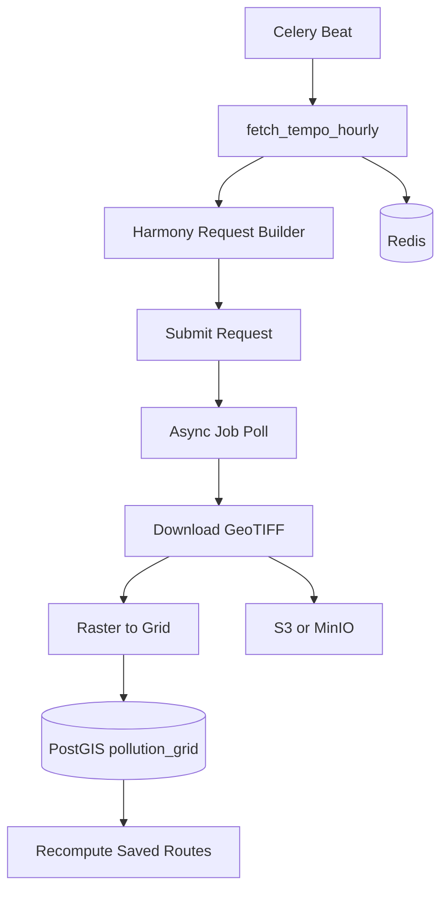

# Data Ingestion and Scheduler Layer

This document describes the **backend Data Ingestion and Scheduler Layer** for AERIS (Air Emissions Regional Intelligence System). The layer integrates NASA Harmony (OGC API Coverages) as the ingestion source for TEMPO data, driven by Celery + Redis, with production Earthdata credentials from `.env`, raster-to-grid normalization into PostGIS, optional S3/MinIO audit, and saved-route exposure recompute.

---

## Table of contents

1. [Context and overview](#1-context-and-overview)
2. [Target flow (architecture diagram)](#2-target-flow-architecture-diagram)
3. [Config and environment](#3-config-and-environment)
4. [Harmony integration service](#4-harmony-integration-service)
5. [Raster normalization layer](#5-raster-normalization-layer)
6. [PostGIS storage](#6-postgis-storage)
7. [Celery scheduler](#7-celery-scheduler)
8. [Saved route exposure recompute](#8-saved-route-exposure-recompute)
9. [Redis usage](#9-redis-usage)
10. [Traffic integration (optional / phase 2)](#10-traffic-integration-optional--phase-2)
11. [Dependencies and directory layout](#11-dependencies-and-directory-layout)
12. [Production hardening](#12-production-hardening)
13. [Running the layer](#13-running-the-layer)

---

## 1. Context and overview

- **Credentials:** Sourced from `.env`: `BEARER_TOKEN`, `EARTHDATA_USERNAME`, `EARTHDATA_PASSWORD`. They are used for production Earthdata/Harmony and are exposed via `config.py`.
- **Reference notebook:** `Harmony API introduction.ipynb` demonstrates UAT endpoints, bearer token retrieval, OGC API Coverages rangeset URL pattern, async job polling, and GeoTIFF handling with rasterio. This layer uses **production** endpoints and env-based credentials only.
- **Existing scripts:** `tempo_all.py` and `TEMPO.py` use the `harmony` Python client with interactive auth. The ingestion layer uses **requests + Bearer token** and the OGC rangeset URL pattern so the scheduler can run **headless** with `.env` credentials.

---

## 2. Target flow (architecture diagram)

End-to-end flow from scheduler to PostGIS, S3, Redis, and saved-route recompute:



**Flow summary:**

| Step | Component | Description |
|------|------------|-------------|
| 1 | **Celery Beat** | Triggers `fetch_tempo_hourly` on a schedule (hourly at minute 0). |
| 2 | **fetch_tempo_hourly** | Celery task: for each gas, builds Harmony URL, submits, polls if async, downloads GeoTIFF. |
| 3 | **Harmony Request Builder** | Builds OGC Coverages rangeset URL (lon, lat, time, format=image/tiff). |
| 4 | **Submit** | GET with `Authorization: Bearer <token>`; may return redirect to job URL (async). |
| 5 | **Async Job Poll** | If async, polls job URL until status is successful/complete or failed. |
| 6 | **Download GeoTIFF** | Writes GeoTIFF to a temp file (or from sync 200 response). |
| 7 | **Raster to Grid** | `services/raster_normalizer`: GeoTIFF → grid rows (WKT polygon, severity) in chunks. |
| 8 | **PostGIS** | Bulk insert into `pollution_grid` (sync SQLAlchemy + GeoAlchemy2 WKTElement). |
| 9 | **S3 or MinIO** | Optional upload of raw GeoTIFF for audit (`audit/geotiff/{date}/{gas}_{hour}.tif`). |
| 10 | **Redis** | After successful ingest: `setex("tempo:last_update", 3600, iso_timestamp)`. |
| 11 | **Recompute Saved Routes** | Celery task: for each `saved_routes` row, ST_Intersects with latest grid, update exposure score. |

---

## 3. Config and environment

### 3.1 Settings in `config.py`

The following were added (or confirmed) for the ingestion layer:

| Setting | Type | Source env | Description |
|---------|------|------------|-------------|
| `bearer_token` | `Optional[str]` | `BEARER_TOKEN` | Prefer this for Harmony; if unset, token is refreshed from username/password. |
| `earthdata_username` | `Optional[str]` | `EARTHDATA_USERNAME` | Earthdata login for token refresh. |
| `earthdata_password` | `Optional[str]` | `EARTHDATA_PASSWORD` | Earthdata password for token refresh. |
| `redis_url` | `Optional[str]` | `REDIS_URL` | Celery broker and result backend; also used for `tempo:last_update`. |

### 3.2 Production base URLs (constants in `config.py`)

| Constant | Value | Use |
|----------|--------|-----|
| `CMR_BASE_URL` | `https://cmr.earthdata.nasa.gov` | CMR catalog (collection IDs resolved at setup, not on every run). |
| `HARMONY_BASE_URL` | `https://harmony.earthdata.nasa.gov` | Harmony OGC API. |
| `URSA_TOKEN_URL` | `https://urs.earthdata.nasa.gov/api/users/token` | POST to create token. |
| `URSA_TOKENS_URL` | `https://urs.earthdata.nasa.gov/api/users/tokens` | GET existing tokens. |

**Important:** Production uses `urs.earthdata.nasa.gov` and `harmony.earthdata.nasa.gov` only — **not UAT**.

### 3.3 `.env.example` documentation

In `.env.example` the following are documented for Earthdata/Harmony:

- `BEARER_TOKEN` — Bearer token from https://urs.earthdata.nasa.gov; optional if username/password are set.
- `EARTHDATA_USERNAME` — Earthdata login.
- `EARTHDATA_PASSWORD` — Earthdata password.
- Note: production only (not UAT).

---

## 4. Harmony integration service

**Module:** `services/harmony_service.py`

### 4.1 Responsibilities

- **Token:** Prefer `BEARER_TOKEN` from config. If missing, obtain token via Earthdata API:
  - Try `GET URSA_TOKENS_URL` with Basic auth; use first existing token if available.
  - Else `POST URSA_TOKEN_URL` with Basic auth (`EARTHDATA_USERNAME` / `EARTHDATA_PASSWORD`).
- **Collection IDs:** TEMPO collection IDs are stored as constants (no CMR call on each run):

  | Gas | Collection ID |
  |-----|----------------|
  | NO2 | C2930763263-LARC_CLOUD |
  | CH2O | C2930763264-LARC_CLOUD |
  | AI | C2930763265-LARC_CLOUD |
  | PM | C2930763266-LARC_CLOUD |
  | O3 | C2930763267-LARC_CLOUD |

- **Build request URL:** `build_tempo_rangeset_url(collection_id, variable, west, south, east, north, start_time, end_time, format="image/tiff")` builds the OGC API Coverages rangeset URL:
  - Pattern: `{HARMONY_BASE_URL}/{collection_id}/ogc-api-coverages/1.0.0/collections/{variable}/coverage/rangeset?subset=lon({west}:{east})&subset=lat({south}:{north})&subset=time("{start_time}":"{end_time}")&format=image/tiff`
- **Submit and poll:** `submit_request(url, token)` — GET with `Authorization: Bearer <token>`. Returns `(response, job_url, is_async)`. If redirect (302/303/307) or 200 JSON with `jobID`, treat as async; then `wait_for_job(job_url, token)` polls until status is `successful`/`complete` or `failed`/`canceled`. On success, download links come from response `links`.
- **Download:** `download_to_temp_file(url, token, suffix=".tif")` writes GeoTIFF to a temp file; sync 200 binary response is also written to a temp file in `fetch_tempo_geotiff`.
- **Retry:** `_request_with_retry` applies exponential backoff on HTTP 429/500; job URL is logged for traceability.

### 4.2 Main API

| Function | Description |
|----------|-------------|
| `get_bearer_token()` | Returns Bearer token from config or Earthdata API. |
| `build_tempo_rangeset_url(...)` | Builds Harmony rangeset URL for given collection, bbox, and time range. |
| `submit_request(url, token)` | Submits GET; returns `(response, job_url, is_async)`. |
| `wait_for_job(job_url, token, ...)` | Polls until job completes or fails. |
| `download_to_temp_file(url, token, suffix)` | Downloads URL to temp file. |
| `fetch_tempo_geotiff(gas, west, south, east, north, start_time, end_time)` | End-to-end: build URL, submit, poll if async, download; returns path to temp GeoTIFF or `None`. Caller must unlink the file when done. |

---

## 5. Raster normalization layer

**Module:** `services/raster_normalizer.py`  
**Shared thresholds/classification:** `pollution_utils.py` (used by both API server and ingestion).

### 5.1 Input

- GeoTIFF file path (from Harmony download).

### 5.2 Logic

- **rasterio:** Open GeoTIFF, read band 1, get affine `transform`.
- **Grid iteration:** Iterate over pixel grid; optionally **subsample** to cap cell count (default `max_cells=5000`). For each pixel:
  - `lon_c, lat_c = xy(transform, row, col)` (pixel center).
  - Pixel bounds derived from transform cell size (half-pixel box).
  - Build WKT polygon for the cell (closed ring).
  - Value → severity via `classify_pollution_level(value, gas)` from `pollution_utils`.
- **Output:** Iterator of **chunks** of row dicts; each row has: `timestamp`, `gas_type`, `geom_wkt`, `pollution_value`, `severity_level`.

### 5.3 Chunking

- Default chunk size: 2000 rows; default max cells per gas: 5000.
- Each chunk is bulk-inserted into `pollution_grid` using GeoAlchemy2 `WKTElement(geom_wkt, srid=4326)`.

### 5.4 `pollution_utils.py`

- **POLLUTION_THRESHOLDS:** Per-gas thresholds for moderate / unhealthy / very_unhealthy / hazardous (NO2, CH2O, AI, PM, O3).
- **classify_pollution_level(value, gas)** → `(level_name, severity_level)` where severity is 0–4. Used by both the API server and the raster normalizer to avoid circular imports.

---

## 6. PostGIS storage

### 6.1 Table: `pollution_grid`

**Location:** `database/models.py` — model `PollutionGrid`.

No schema change was required for the minimal pipeline. Columns:

| Column | Type | Description |
|--------|------|-------------|
| `id` | Integer, PK | Auto-increment. |
| `timestamp` | DateTime(timezone=True) | Time of the observation window. |
| `gas_type` | Text | e.g. NO2, CH2O, AI, PM, O3. |
| `geom` | Geometry(POLYGON, 4326) | Cell polygon (WGS84). |
| `pollution_value` | Double | Raw value from raster. |
| `severity_level` | Integer | 0–4 from `classify_pollution_level`. |
| `created_at` | DateTime(timezone=True) | Server default. |

### 6.2 Indexes (from initial migration)

- `ix_pollution_grid_gas_type` on `gas_type`.
- `idx_pollution_grid_time_gas` on `(timestamp, gas_type)`.
- `idx_pollution_grid_geom` — GIST index on `geom` for spatial queries (e.g. `ST_Intersects`).

### 6.3 Optional (phase 2)

- Traffic-adjusted columns (e.g. `base_pollution_value`, `traffic_adjusted_value`) or a separate table; not implemented in the current layer.

---

## 7. Celery scheduler

### 7.1 Broker and app

- **Broker & backend:** Redis, from `config.settings.redis_url` (default `redis://localhost:6379/0`).
- **App:** `celery_app.py` — Celery app `"aeris"`, `include=["tasks.pollution_tasks"]`, JSON serialization, UTC.

### 7.2 Task: `fetch_tempo_hourly`

**Registered name:** `tasks.pollution_tasks.fetch_tempo_hourly`  
**File:** `tasks/pollution_tasks.py`

**Steps (per plan):**

1. **Resolve bearer token** — Via Harmony service `get_bearer_token()` (config or Earthdata API).
2. **For each gas (NO2, CH2O, AI, PM, O3):** Build Harmony rangeset URL for **last completed hour** (UTC), submit request, poll job until complete if async, download GeoTIFF to temp file.
3. **Optional upload:** If object storage is configured (`storage.is_configured()`), upload raw GeoTIFF to S3/MinIO with key `audit/geotiff/{YYYY-MM-DD}/{gas}_{HH}.tif`.
4. **Raster normalizer:** Run `geotiff_to_grid_rows(path, gas, timestamp)` → iterate chunks of row dicts.
5. **Bulk-insert:** Sync SQLAlchemy session; for each chunk, build `PollutionGrid` rows with `WKTElement(geom_wkt, srid=4326)`, `session.add_all(rows)`, `session.commit()`.
6. **Traffic multiplier:** Not implemented (phase 2).
7. **Trigger recompute:** After any successful inserts, call `recompute_saved_route_exposure.apply_async()`.
8. **Redis:** `redis.setex("tempo:last_update", 3600, timestamp.isoformat())`.

**Bbox:** Default CONUS-style; overridable via env: `TEMPO_BBOX_WEST`, `TEMPO_BBOX_SOUTH`, `TEMPO_BBOX_EAST`, `TEMPO_BBOX_NORTH`.

**Sync DB:** Workers use a sync PostgreSQL URL derived from `config.settings.database_url` by replacing `postgresql+asyncpg` with `postgresql+psycopg2` (see `_sync_database_url()` and `_get_sync_session()` in `tasks/pollution_tasks.py`).

### 7.3 Celery Beat schedule

- **Schedule:** `crontab(minute=0)` — hourly at minute 0 (UTC).
- **Beat schedule key:** `fetch-tempo-hourly` → task `tasks.pollution_tasks.fetch_tempo_hourly`.

### 7.4 Running worker and beat

- **Worker only:** `celery -A celery_app worker -l info`
- **Beat only:** `celery -A celery_app beat -l info`
- **Development (worker + beat in one process):** `celery -A celery_app worker -l info -B`

Run from the project root: `air-emissions-regional-intelligence-system/`.

---

## 8. Saved route exposure recompute

### 8.1 Task: `recompute_saved_route_exposure`

**Registered name:** `tasks.pollution_tasks.recompute_saved_route_exposure`  
**File:** `tasks/pollution_tasks.py`  
**Invoked:** At the end of `fetch_tempo_hourly` after successful ingest (via `apply_async()`).

### 8.2 Logic

- Load all rows from `saved_routes`.
- Get latest `MAX(timestamp)` from `pollution_grid`; if none, skip.
- For each saved route:
  - Build route geometry as **LINESTRING(origin_lon origin_lat, dest_lon dest_lat)** (WGS84).
  - Query: `SELECT AVG(pollution_value), SUM(severity_level) FROM pollution_grid WHERE ST_Intersects(geom, ST_GeomFromText(:wkt, 4326)) AND timestamp >= :ts_start AND timestamp <= :ts_end` with `ts_start = max_ts - 1 hour`, `ts_end = max_ts`.
  - Compute exposure score (e.g. `avg_val * 0.5 + sum_sev * 10.0`), round; update `saved_routes.last_computed_score` and `last_updated_at`.
- Commit session.

Uses the same sync SQLAlchemy session factory as `fetch_tempo_hourly`.

---

## 9. Redis usage

- **Last update:** After successful ingest, `redis.setex("tempo:last_update", 3600, iso_timestamp)` (TTL 3600 seconds). Key can be read by API or dashboard to show “last TEMPO update”.
- **Job status cache:** Optional; plan mentioned caching Harmony job URL/status by job_id (TTL e.g. 1 hour). Not implemented in the current layer; job URL is logged for traceability.
- **API cache:** Existing weather/pollutant cache in the app is unchanged; optional “latest grid summary” cache (15–30 min TTL) can be added later.

---

## 10. Traffic integration (optional / phase 2)

- **Intent:** External traffic API (congestion, speed, incidents) → multiplier applied to pollution or stored in separate columns.
- **Schema options:** Add columns to `pollution_grid` (e.g. `base_pollution_value`, `traffic_adjusted_value`) or a separate `traffic_factors` table.
- **Status:** Not implemented; deferred to a follow-up phase.

---

## 11. Dependencies and directory layout

### 11.1 Added dependencies (`requirements.txt`)

- `celery[redis]` — Celery with Redis broker/backend.
- `rasterio` — GeoTIFF read and transform.
- `psycopg2-binary` — Sync PostgreSQL driver for Celery workers (async app uses `asyncpg`).
- `requests` was already present; used by Harmony service.

### 11.2 Directory layout (new/updated files)

```
air-emissions-regional-intelligence-system/
├── config.py                    # + bearer_token, earthdata_*, URL constants
├── pollution_utils.py           # POLLUTION_THRESHOLDS, classify_pollution_level (shared)
├── celery_app.py                # Celery app, Beat schedule
├── tasks/
│   ├── __init__.py
│   └── pollution_tasks.py       # fetch_tempo_hourly, recompute_saved_route_exposure
├── services/
│   ├── __init__.py
│   ├── harmony_service.py       # Token, URL build, submit, poll, download
│   └── raster_normalizer.py    # GeoTIFF → grid rows (chunked)
├── database/
│   └── models.py                # PollutionGrid (unchanged schema)
└── docs/
    └── DATA_INGESTION_AND_SCHEDULER_LAYER.md   # This document
```

---

## 12. Production hardening

- **Endpoints:** Use only production: `cmr.earthdata.nasa.gov`, `harmony.earthdata.nasa.gov`, `urs.earthdata.nasa.gov`.
- **Credentials:** From environment (or secret store); never hardcoded. Prefer `BEARER_TOKEN`; refresh from `EARTHDATA_USERNAME` / `EARTHDATA_PASSWORD` when needed.
- **Retries:** Exponential backoff on HTTP 429/500 in Harmony `_request_with_retry`.
- **Chunking:** Raster processed in limited cell count (default 5000 per gas); bulk inserts in chunks (default 2000 rows per commit).
- **Logging:** Job URL and status logged for each Harmony request.
- **Audit:** Raw GeoTIFF can be stored in S3/MinIO at `audit/geotiff/{date}/{gas}_{hour}.tif` when object storage is configured.

---

## 13. Running the layer

**Prerequisites:**

- `.env` with at least one of: `BEARER_TOKEN` or (`EARTHDATA_USERNAME` + `EARTHDATA_PASSWORD`).
- `REDIS_URL` set (e.g. `redis://localhost:6379/0`).
- PostgreSQL with PostGIS and `pollution_grid` (and `saved_routes`) created (Alembic migrations).
- Optional: S3 or MinIO configured for GeoTIFF audit upload.

**From project root** (`air-emissions-regional-intelligence-system/`):

```bash
# Install dependencies (if not already)
pip install -r requirements.txt

# Run worker (consumes tasks)
celery -A celery_app worker -l info

# Run beat (schedules fetch_tempo_hourly hourly)
celery -A celery_app beat -l info

# Or run worker + beat in one process (e.g. dev)
celery -A celery_app worker -l info -B
```

After the first run at minute 0 (UTC), `pollution_grid` will be populated for the last completed hour and `tempo:last_update` will be set in Redis; saved route exposure scores will be updated by `recompute_saved_route_exposure`.
