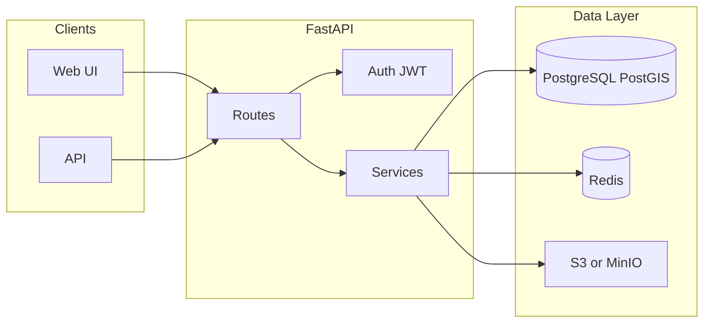

# AERIS — Architecture and Data Layer

This document describes the **target architecture** of the AERIS system, with emphasis on the data layer (PostgreSQL + PostGIS, Redis, S3/MinIO) and how it integrates with the FastAPI backend. For implementation details, endpoints, and configuration, see [PROJECT_DOCUMENTATION.md](PROJECT_DOCUMENTATION.md).

---

## 1. High-Level Architecture Diagram

Clients (Web UI and external API consumers) hit FastAPI. Routes are protected by auth where needed; services implement business logic and talk to the data layer: PostgreSQL/PostGIS for structured and spatial data, Redis for caching, and S3 or MinIO for large NetCDF files.

**Flow in words:**

- **Web** and **API** send requests to **Routes**.
- **Routes** use **Auth** (JWT) for protected endpoints and delegate to **Services**.
- **Services** read/write **PostgreSQL/PostGIS** (users, saved routes, pollution grid, NetCDF metadata), use **Redis** for cached responses (e.g. weather, pollutant movement), and store/retrieve **NetCDF blobs** in **S3 or MinIO**.

---

## 2. Data Layer — What Lives Where

| Concern | Storage | Usage |
|--------|---------|--------|
| Users, saved routes, NetCDF metadata, pollution grid | PostgreSQL + PostGIS | Auth, CRUD, spatial queries |
| Weather, pollutant predictions, hotspot/analysis/route cache | Redis | TTL cache in front of external APIs and heavy compute |
| NetCDF blobs | S3 or MinIO (env-driven) | Store/retrieve by bucket path; metadata in DB |

---

## 3. Component Summary

### 3.1 PostgreSQL + PostGIS

- **Extensions:** `postgis`, `postgis_topology`; default SRID **4326 (WGS 84)**.
- **Tables:** `users`, `saved_routes`, `pollution_grid` (with `geom` and GIST index), `netcdf_files`.
- **ORM:** SQLAlchemy 2.x (async) + GeoAlchemy2; migrations via Alembic.
- **FastAPI:** Lifespan ensures PostGIS extensions exist; `get_db()` yields an async session for routes that need the DB.

### 3.2 Redis

- **Role:** Optional cache (when `REDIS_URL` is set). Reduces repeat calls to WeatherAPI and caches pollutant movement and related results.
- **Pattern:** Check cache by key; on miss, call external API or run computation, then `SETEX` with TTL. Example keys: `weather:{lat}:{lon}:{days}`, `pollutant_movement:{lat}:{lon}` (e.g. 600 s TTL).
- **FastAPI:** Connection created at startup and stored on `app.state.redis`; closed on shutdown.

### 3.3 Object Storage (S3 / MinIO)

- **Role:** Store large NetCDF files; only metadata (file_name, bucket_path, timestamp, gas_type) lives in PostgreSQL (`netcdf_files`).
- **Resolver:** “Latest file per gas” is resolved by querying `netcdf_files`, then downloading the object to a temp file for analysis; fallback to local `TempData/` when object storage is not configured.
- **Config:** Env-driven (`OBJECT_STORAGE_PROVIDER`, endpoint, bucket, AWS credentials for S3 or MinIO).

### 3.4 Authentication

- **Mechanism:** JWT (Bearer token); password hashing with passlib/bcrypt.
- **Endpoints:** `POST /auth/register`, `POST /auth/login`, `GET /auth/me`; saved-routes CRUD require `Authorization: Bearer <token>`.

---

## 4. Request Flow (Data Layer Perspective)

1. **Incoming request** → Routes (optional Auth for protected endpoints).
2. **Analysis/route requests** → Resolve NetCDF: query `netcdf_files` and download from S3/MinIO if configured, else use `TempData/`; then run analysis; optionally persist pollution grid to PostGIS when `PERSIST_POLLUTION_GRID=true`.
3. **Weather/pollutant APIs** → Check Redis; on miss, call WeatherAPI (or predictor), then cache with TTL.
4. **Saved routes / user** → Read/write PostgreSQL via async session from `get_db()`.

---

## 5. Optionality and Fallbacks

- **Database:** If DB is unavailable at startup, the app still starts; routes that need the DB will fail when used. Auth and saved-routes require a working DB.
- **Redis:** If `REDIS_URL` is empty or Redis is down, no caching is used; external APIs are called on every request.
- **Object storage:** If not configured, NetCDF resolution falls back to filesystem scan of `TempData/`.

For full setup (local dev), use `docker compose up -d` (Postgres+PostGIS, Redis, MinIO) and run `alembic upgrade head` before starting the app.
