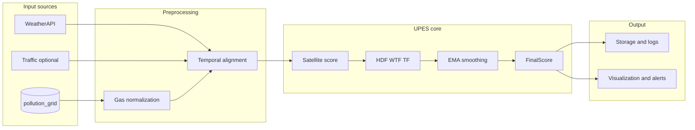

# Pollution Intelligence Engine — Unified Pollution Exposure Score (UPES)

This document describes the **UPES** pipeline: a parallel layer that computes a Unified Pollution Exposure Score from satellite (`pollution_grid`), weather, and optional traffic data. It does not replace existing route exposure or analysis logic; it provides hourly gridded scores, storage, APIs, and visualization.

---

## 1. Overview

### Architecture



- **Inputs:** PostGIS `pollution_grid` (per gas, hourly), WeatherAPI at bbox center (humidity, wind), optional traffic stub.
- **Pipeline:** Aggregate to regular grid → normalize gases (0–1) → satellite score → environmental modifiers (HDF, WTF, TF) → optional EMA → final score.
- **Outputs:** GeoTIFF rasters (satellite_score, final_score), JSON logs per run, Redis `upes:last_update`.
- **Schedule:** Celery task `compute_upes_hourly` at minute 15 and after `fetch_tempo_hourly` when ingest succeeds.

---

## 2. Config

In [config.py](../config.py):

| Setting | Type | Default | Description |
|--------|------|---------|-------------|
| `upes_output_base` | Optional[str] | None (→ `outputs/` under project root) | Base directory for UPES outputs. |
| `upes_grid_resolution_deg` | float | 0.05 | Grid cell size in degrees. |
| `upes_bbox_west/south/east/north` | Optional[float] | None (use TEMPO bbox) | Override bbox for UPES grid. |
| `upes_traffic_alpha` | float | 0.1 | TF = 1 + alpha * traffic_density. |
| `upes_ema_lambda` | Optional[float] | 0.6 | EMA smoothing; None to disable. |
| `upes_alert_threshold` | float | 0.5 | FinalScore > threshold = high-risk in heatmap. |
| `upes_enabled` | bool | True | If False, task skips. |

Gas weights are in `config.UPES_DEFAULT_WEIGHTS` (NO2, PM, O3, CH2O, AI).

---

## 3. Modules

- **services/upes/preprocessing.py:** `normalize_gas`, `percentile_bounds`, `normalize_gas_with_bounds`, `hour_slot_utc`.
- **services/upes/core.py:** `compute_satellite_score`, `humidity_dispersion_factor`, `wind_factor`, `traffic_factor`, `apply_ema`, `compute_final_score`.
- **services/upes/grid_aggregation.py:** `GridSpec`, `aggregate_pollution_grid_to_regular` (query PostGIS, aggregate to regular grid per gas).
- **services/upes/storage.py:** `upes_output_base`, `ensure_dirs`, `write_geotiff`, `write_upes_rasters`, `write_upes_log`.
- **services/upes/visualization.py:** `render_upes_heatmap` (Matplotlib heatmap from final_score GeoTIFF, optional high-risk contour).

---

## 4. Directory layout (outputs)

```
outputs/
  raw/                    # optional
  normalized/             # optional
  hourly_scores/
    satellite_score/      # satellite_score_YYYYMMDD_HH.tif
    final_score/          # final_score_YYYYMMDD_HH.tif
  logs/                   # upes_YYYYMMDD_HH.json
```

---

## 5. Celery task and schedule

- **Task:** `tasks.pollution_tasks.compute_upes_hourly`
- **Steps:** Read latest hour from `pollution_grid` → aggregate to grid → weather at bbox center → normalize → satellite score → HDF/WTF/TF → (optional) load previous final score for EMA → final score → write GeoTIFF + JSON log → set Redis `upes:last_update`.
- **Beat:** `crontab(minute=15)` (hourly at :15). Also triggered after `fetch_tempo_hourly` when inserts > 0.

---

## 6. API

| Endpoint | Description |
|----------|-------------|
| `GET /api/upes/latest` | JSON: timestamp, last_update (Redis), paths to latest rasters, satellite_score, humidity_factor, wind_factor, traffic_factor, final_score from latest log. |
| `GET /api/upes/grid?timestamp=...` | JSON: paths for given timestamp (or latest if omitted). |
| `GET /api/upes/heatmap` | PNG heatmap of latest final_score raster (high-risk contour if threshold set). |

---

## 7. Usage

- Ensure `pollution_grid` is populated (run ingestion first). Set `upes_enabled=true` and run worker + beat. After an ingest and/or at :15, `compute_upes_hourly` will write to `outputs/` and update Redis.
- Call `GET /api/upes/latest` or `GET /api/upes/heatmap` to inspect results.
