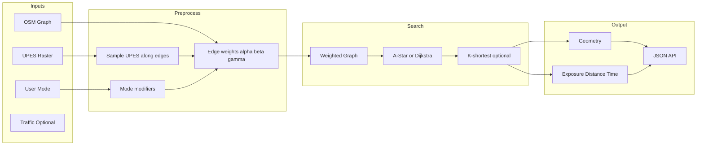

# Route Optimization Engine

This document describes the **pollution-aware route optimization** layer in AERIS: inputs, weights, mode modifiers, pathfinding, API, and caching. The engine uses **OSMnx** (OpenStreetMap graph) and **UPES** (Unified Pollution Exposure Score) rasters to compute routes that balance exposure, distance, and time according to a user-selected mode (commute, jogger, cyclist).

---

## 1. Architecture Overview



- **Inputs:** UPES raster (latest `final_score_*.tif`), OSM graph (bbox around origin/destination), and user **mode** (commute / jogger / cyclist).
- **Preprocessing:** Sample UPES along each OSM edge; compute edge cost as a weighted sum of exposure, distance, and time; apply mode-specific modifiers from OSM tags.
- **Search:** Shortest path (Dijkstra) on the weighted graph; optional k-shortest for alternatives.
- **Output:** GeoJSON geometry plus exposure, distance_km, time_min, and cost per route.

---

## 2. Inputs

| Source | Implementation | Notes |
|--------|-----------------|--------|
| **UPES raster** | Latest `final_score_*.tif` from `services/upes/storage.upes_output_base()` → `hourly_scores/final_score/`. Loaded with **rasterio**; sampled along each edge geometry. | If no UPES file exists, fallback scalar **0.5** is used for all edges. |
| **OSM graph** | **osmnx**: `ox.graph_from_bbox(north, south, east, west, network_type='all')` with a buffer (config: `route_osm_buffer_km`, default 3 km) around origin/destination. | Edges retain OSM tags (`highway`, `cycleway`, `footway`, `leisure`, etc.) for mode modifiers. |
| **User mode** | Query/body parameter `mode` ∈ `commute` \| `jogger` \| `cyclist`. | Can be taken from form (`route_mode`), saved route `activity_type`, or API param. |

---

## 3. UPES Sampling Along Edges

- **Module:** `services/route_optimization/upes_sampling.py`
- **Function:** `sample_upes_along_line(raster_path, line_coords, step_m=50, fallback=0.5) -> float`
  - **Input:** Path to final_score GeoTIFF (or `None`), line as list of `(lon, lat)` in WGS84.
  - **Logic:** Resample line at intervals of `step_m` meters; for each point use rasterio’s transform to get row/col and sample value; return **mean** of valid samples in [0, 1].
  - **Fallback:** If raster is missing or all samples are invalid, returns `fallback` (default 0.5).

---

## 4. Edge Weights and Mode Modifiers

### 4.1 Cost Formula

For each edge:

- `distance_km = length_m / 1000`
- `time_h = distance_km / max(speed_kph, 5)` (speed from OSM `maxspeed` or highway-type default)
- `mean_upes = sample_upes_along_line(raster_path, edge_geometry)`
- `modifier = mode_modifier(edge_data, mode)` (see below)
- **Edge weight:**  
  `weight = modifier * (α * mean_upes + β * distance_km + γ * time_h)`

(α, β, γ) are **mode-specific** and sum to 1.0.

### 4.2 Mode Weights (α, β, γ)

| Mode | α (exposure) | β (distance) | γ (time) |
|------|----------------|--------------|----------|
| commute / commuter | 0.2 | 0.4 | 0.4 |
| jogger / jog | 0.7 | 0.15 | 0.15 |
| cyclist / cycle | 0.4 | 0.3 | 0.3 |

Defined in `services/route_optimization/weights.py` (`MODE_WEIGHTS`, `get_weights(mode)`).

### 4.3 Mode Modifier (per edge)

Multiplier from OSM tags; **> 1** = penalty, **< 1** = bonus, **1** = neutral. Clamped to [0.1, 5.0].

- **Jogger:**  
  - Penalty (×2) for `highway` ∈ motorway, trunk, motorway_link, trunk_link.  
  - Bonus (×0.5) for `leisure=park` or `highway` ∈ path, footway, pedestrian.
- **Cyclist:**  
  - Bonus (×0.7) if `cycleway` (or cycleway:left/right) present.  
  - Penalty (×1.5) for motorway/trunk.
- **Commuter:**  
  - Slight penalty (×1.2) for footway/path/pedestrian when not explicitly accessible.

Implemented in `mode_modifier(edge_data, mode)` in `services/route_optimization/weights.py`.

---

## 5. Graph Construction and Pathfinding

- **Graph build:** `services/route_optimization/graph_builder.py`
  - `get_latest_upes_raster_path()` → path to latest final_score GeoTIFF or `None`.
  - `build_weighted_graph(north, south, east, west, mode, upes_raster_path)` → NetworkX graph with edge attributes `weight`, `length_m`, `mean_upes`, `time_h` (and geometry for aggregation).
- **Pathfinding:** `services/route_optimization/pathfinding.py`
  - Origin/destination (lat, lon) → nearest graph nodes via `ox.nearest_nodes(G, lon, lat)`.
  - **Shortest path:** `networkx.shortest_path(G, source, target, weight='weight')` (Dijkstra).
  - **K-shortest:** `networkx.shortest_simple_paths` for up to `k` alternative routes.
  - **Aggregation:** Concatenate edge geometries → LineString; total exposure = sum over edges of `mean_upes * length_km`; total distance_km; total time_h → time_min.

---

## 6. API

### 6.1 Endpoints

| Endpoint | Method | Description |
|----------|--------|-------------|
| `/api/route/optimized` | GET | Query params: `start_lat`, `start_lon`, `end_lat`, `end_lon`, `mode` (default `commute`), optional `alternatives` (e.g. 2 or 3). Returns JSON with `routes`. |
| `/api/route/optimized` | POST | Body: `origin: { lat, lon }`, `destination: { lat, lon }`, optional `mode`, optional `alternatives`. Same response shape. |

When `route_optimization_enabled` is false or the engine fails (e.g. no graph), the API returns an error or empty routes as appropriate.

### 6.2 Response Shape

```json
{
  "routes": [
    {
      "nodes": [12345, 67890, ...],
      "geometry": { "type": "LineString", "coordinates": [[lon, lat], ...] },
      "exposure": 0.42,
      "distance_km": 3.1,
      "time_min": 12.5,
      "cost": 1.23
    }
  ]
}
```

- **exposure:** Sum of (mean_upes × length_km) along the route (not normalized).
- **distance_km:** Total route length in km.
- **time_min:** Estimated travel time in minutes.
- **cost:** Sum of edge weights (used for ranking).

---

## 7. Caching

- **Route result cache:** Key `route_opt:{start_lat}:{start_lon}:{end_lat}:{end_lon}:{mode}` (see `cache.key_route_optimized`). TTL from config: `route_result_cache_ttl` (default 300 seconds). On cache hit, the stored JSON is returned without rebuilding the graph or recomputing the path.
- **OSM graph cache:** Optional; not implemented in the initial version. When added, key could be `route_graph:{bbox_hash}` with TTL `route_graph_cache_ttl` (e.g. 600 s) to avoid repeated osmnx fetches for the same area.

---

## 8. Configuration

In `config.py` (and `.env` overrides):

| Setting | Default | Description |
|---------|---------|-------------|
| `route_optimization_enabled` | `True` | Master switch for the optimized route API and UI option. |
| `route_osm_buffer_km` | `3.0` | Buffer in km around origin/destination to build the OSM bbox. |
| `route_result_cache_ttl` | `300` | TTL in seconds for cached optimized route results. |
| `route_graph_cache_ttl` | `600` | Reserved for future OSM graph-by-bbox cache TTL. |

---

## 9. UI Integration

- **Route form** (Next.js `frontend/components/RouteForm.tsx`): Checkbox **“Use pollution-optimized route (UPES + OSM)”** and dropdown **“Mode”** (commute / jogger / cyclist). When the checkbox is checked and optimization is enabled, `POST /api/route/analyze` uses the new engine and sets status text to “Pollution-optimized route (UPES + OSM)”.
- **Fallback:** If optimized routing is disabled or fails, the existing OSRM + `score_route_exposure` flow is used.

---

## 10. File Reference

| Area | Files |
|------|--------|
| Config | `config.py`: `route_optimization_enabled`, `route_osm_buffer_km`, `route_result_cache_ttl`, `route_graph_cache_ttl` |
| UPES sampling | `services/route_optimization/upes_sampling.py`: `sample_upes_along_line` |
| Weights / modifiers | `services/route_optimization/weights.py`: `MODE_WEIGHTS`, `get_weights`, `mode_modifier` |
| Graph | `services/route_optimization/graph_builder.py`: `get_latest_upes_raster_path`, `build_weighted_graph` |
| Pathfinding | `services/route_optimization/pathfinding.py`: shortest path, k-shortest, geometry and metrics aggregation |
| API | `api_server.py`: GET/POST `/api/route/optimized`; `analyze_route` with `use_optimized` and `route_mode` |
| Cache | `cache.py`: `key_route_optimized` |

---

## 11. Testing and compatibility with data / ingestion layers

- **Unit tests** (see `tests/`): `test_route_optimization_weights.py`, `test_route_optimization_upes_sampling.py`, `test_route_optimization_pathfinding.py`, `test_route_optimization_graph_builder.py`, `test_route_optimization_api.py`. They cover weights and mode modifiers, UPES sampling along lines, pathfinding and geometry aggregation, graph builder (including `get_latest_upes_raster_path` from UPES storage), and cache key compatibility with the data layer.
- **Verification report:** [ROUTE_OPTIMIZATION_ENGINE_VERIFICATION.md](ROUTE_OPTIMIZATION_ENGINE_VERIFICATION.md) maps each requirement in this document to implementation and tests, and confirms conformance with the Data Layer and Data Ingestion and Scheduler Layer.
- **Data layer:** The route result cache uses `key_route_optimized(start_lat, start_lon, end_lat, end_lon, mode)` in `cache.py`; Redis is optional (see [DATA_LAYER.md](DATA_LAYER.md)).
- **Ingestion layer:** UPES rasters (`final_score_*.tif`) are produced by the Celery UPES pipeline (see [DATA_INGESTION_AND_SCHEDULER_LAYER.md](DATA_INGESTION_AND_SCHEDULER_LAYER.md)). The route engine uses `get_latest_upes_raster_path()` from `services/route_optimization/graph_builder.py`, which reads from `upes_output_base()/hourly_scores/final_score/`. If no raster exists, edges use the default UPES fallback (0.5).
- Run route optimization tests: `pytest tests/test_route_optimization_*.py -v`. Some tests skip when `osmnx` or `api_server` (full app) are not available.

Existing OSRM-based routing and `score_route_exposure` remain unchanged; the optimization engine is an additional path used by the new API and the route form when “Use pollution-optimized route” is selected.
